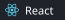

# 신한서 | Mobile App Developer

React Native와 Flutter로 **3개의 모바일 앱을 iOS와 Android에 출시**했습니다.
크로스플랫폼 앱 출시 경험을 바탕으로, **Kotlin과 Jetpack Compose를 활용한 네이티브 Android 앱 개발**과 온디바이스 AI 적용까지 기술 범위를 확장하고 있습니다.

  
  
  

---

## Selected Work

### noti. — 중요한 알림을 선별하는 Android 앱

기기에 쌓이는 알림 중 사용자가 확인해야 할 알림을 찾고,
왜 중요하다고 판단했는지 설명하는 온디바이스 알림 관리 앱입니다.

- `NotificationListenerService`로 알림을 수집하고 `Room`에 저장
- 설명 가능한 규칙으로 우선 판단하고, 애매한 구간에만 온디바이스 모델 적용
- 실제 알림 데이터를 기준으로 모델 정확도와 앱 용량을 비교한 뒤 ONNX 모델 선정
- Hilt를 이용한 의존성 주입과 JUnit 기반 중요도 판단 로직 테스트

`Kotlin` `Jetpack Compose` `Room` `Hilt` `ONNX Runtime`

---

### 지금이니 — 약속 시간에 맞춘 출발 행동 지원

이동 경로를 바탕으로 출발 시각을 계산하고,
알림과 신발 사진 인증을 통해 실제 출발까지 이어지도록 만든 앱입니다.

- 대중교통 이동 시간과 준비 시간을 반영한 출발 시각 계산
- 출발 전·출발 시각·미인증 상태에 맞춘 로컬 알림 예약 및 정리
- 카메라 판별 결과에 위치와 시간 조건을 결합한 출발 인증
- 오프라인 상태 처리와 iOS·Android 스토어 배포

`React Native` `Expo` `TypeScript` `Zustand` `Node.js`

---

### 모행 — 제주 여행 동행 매칭 서비스

제주 여행자가 조건에 맞는 동행을 모집하고 참여한 뒤,
실시간 채팅으로 일정을 조율할 수 있는 여행 커뮤니티 앱입니다.

- 조건별 동행 탐색과 제주 지역 기반 장소 검증
- Socket.IO 실시간 채팅과 Drift 기반 로컬 메시지 관리
- JWT 인증, FCM 푸시 알림, AWS S3 이미지 업로드를 포함한 백엔드 구현
- 스토어 심사를 고려한 EULA, 신고, 차단 및 사용자 숨김 기능

`Flutter` `Dart` `Node.js` `Socket.IO` `PostgreSQL` `FCM`

---

### 머문 — 장소에 남기는 감정 기록

장소와 사진, 감정을 함께 기록하고
지도와 통계를 통해 자신의 감정 흐름을 돌아볼 수 있는 위치 기반 기록 앱입니다.

- 장소별 감정 기록과 네이버 지도 기반 감정 지도
- 월별·감정별·장소별 보관함과 감정 통계 시각화
- TanStack Query로 서버 상태를, Zustand로 클라이언트 상태를 분리
- 카카오·Apple 로그인과 JWT 기반 인증, iOS·Android 스토어 배포

`React Native` `Expo` `TypeScript` `TanStack Query` `Zustand` `PostgreSQL`

---

## Tech Stack

#### Mobile

  
  
  
  
  

#### Frontend

  
  
  
  
  

#### Backend & Data

  
  
  
  
  
  

#### Infrastructure & Tools

  
  
  

---

## Writing

앱을 만들며 마주친 문제와 기술적 선택을 기록하고 있습니다.

