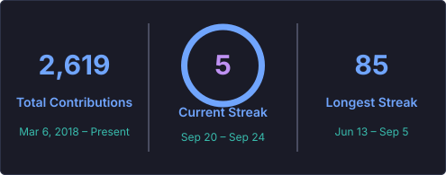

# 안녕하세요, 신한서입니다 

사용자의 일상에 자연스럽게 스며드는 모바일 경험을 만듭니다.

가천대학교 **컴퓨터공학과**에 재학 중이며,  
Flutter · React Native · Android를 중심으로 아이디어를 직접 구현하고 배포합니다.

 

---

## Featured Projects

<table>
<tr>
<td width="33%" valign="top">

<h3 align="center">🐻 지금이니</h3>

<b>약속 시간 지킴이</b>

이동 시간을 바탕으로 출발 시각을 계산하고, 알림과 신발 사진 인증으로 실제 출발 행동을 유도하는 앱입니다.

<code>React Native</code> <code>Expo</code> 
<code>TypeScript</code> <code>Zustand</code>

<a href="https://github.com/shinhanseo/meet_alarm">GitHub</a> ·
<a href="https://github.com/shinhanseo/meet_alarm_backend">Backend</a> 
<a href="https://apps.apple.com/kr/app/id6759585246">App Store</a> ·
<a href="https://play.google.com/store/apps/details?id=com.imkara1.meetalarm">Google Play</a>

</td>
<td width="33%" valign="top">

<h3 align="center">🏝️ 모행</h3>

<b>제주 동행 매칭</b>

제주 여행 모임을 만들고 참여하며, 실시간 채팅으로 일정을 조율할 수 있는 여행 커뮤니티 앱입니다.

<code>Flutter</code> <code>Node.js</code> 
<code>Socket.IO</code> <code>PostgreSQL</code>

<a href="https://github.com/shinhanseo/trip_mate">GitHub</a> 
<a href="https://apps.apple.com/kr/app/id6771613106">App Store</a> ·
<a href="https://play.google.com/store/apps/details?id=com.hanseo.mohaeng">Google Play</a>

</td>
<td width="33%" valign="top">

<h3 align="center">📍 머문</h3>

<b>장소에 남기는 감정</b>

장소와 사진, 감정을 함께 기록하고 지도와 통계로 나의 감정 흐름을 돌아보는 위치 기반 기록 앱입니다.

<code>React Native</code> <code>Expo</code> 
<code>TypeScript</code> <code>PostgreSQL</code>

<a href="https://github.com/shinhanseo/meomun">GitHub</a> 
<a href="https://apps.apple.com/kr/app/id6787008881">App Store</a>

</td>
</tr>
</table>

---

## Tech Stack

<h4>Mobile</h4>

<h4>Frontend</h4>

<h4>Backend & Data</h4>

<h4>Infrastructure & Tools</h4>

---

## GitHub Stats

  
  

