# 안녕하세요, 신한서입니다.

사용자의 일상에 자연스럽게 스며드는 모바일 경험을 고민합니다.

가천대학교 컴퓨터공학과에 재학 중이며,  
Flutter와 React Native를 중심으로 아이디어를 직접 구현하고 배포합니다.

 

## Projects

### 지금이니

**약속 시간 지킴이**

이동 시간을 바탕으로 출발 시각을 계산하고, 알림과 신발 사진 인증으로 실제 출발 행동을 유도하는 앱입니다.

`React Native` · `Expo` · `TypeScript` · `Zustand`

[GitHub](https://github.com/shinhanseo/meet_alarm) · [Backend](https://github.com/shinhanseo/meet_alarm_backend) · [App Store](https://apps.apple.com/kr/app/id6759585246) · [Google Play](https://play.google.com/store/apps/details?id=com.imkara1.meetalarm)

 

### 모행

**제주에서 만나는 여행 친구**

제주 여행 모임을 만들고 참여하며, 실시간 채팅으로 일정을 조율할 수 있는 여행 커뮤니티 앱입니다.

`Flutter` · `Node.js` · `Socket.IO` · `PostgreSQL`

[GitHub](https://github.com/shinhanseo/trip_mate) · [App Store](https://apps.apple.com/kr/app/id6771613106) · [Google Play](https://play.google.com/store/apps/details?id=com.hanseo.mohaeng)

 

### 머문

**장소에 남기는 감정**

장소와 사진, 감정을 함께 기록하고 지도와 통계로 나의 감정 흐름을 돌아보는 위치 기반 기록 앱입니다.

`React Native` · `Expo` · `TypeScript` · `PostgreSQL`

[GitHub](https://github.com/shinhanseo/meomun) · [App Store](https://apps.apple.com/kr/app/id6787008881)

 

## Skills

**Mobile**  
`Flutter` · `React Native` · `Android` · `Kotlin` · `Dart`

**Frontend & Backend**  
`TypeScript` · `JavaScript` · `React` · `Node.js` · `Express` · `PostgreSQL` · `Prisma`

**Infrastructure**  
`AWS` · `Docker` · `GitHub Actions`

 

## GitHub

